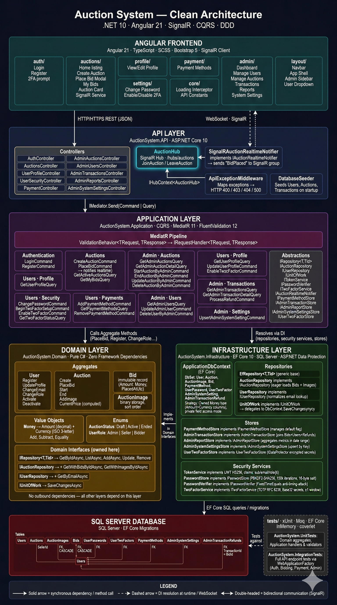

# Auction System

> Enterprise real-time bidding platform built with .NET 10 and Angular 21.


## Overview

Auction System is a Clean Architecture auction platform with a CQRS-driven ASP.NET Core backend and an Angular 21 frontend. It supports authenticated bidding, live auction updates over SignalR, moderation and reporting workflows, and a broad admin surface for marketplace operations.

## Highlights

- Real-time bid broadcasts over SignalR with automatic client reconnect.
- JWT-based authentication with Bidder, Seller, and Admin roles.
- Auction creation with optional image upload and streamed image delivery.
- Public auction discovery with filtering, pagination, and live price refresh.
- User profile editing, password changes, and a secured payment-method API.
- Auction reporting, flagged-case moderation, refunds, reporting, and admin settings.
- Theme-aware Angular UI with dark and light modes.

## Current Status

- Backend and API flows are implemented for authentication, auctions, bidding, reporting, moderation, admin operations, and payment-method management.
- Frontend routes are implemented for marketplace browsing, account areas, and admin dashboards.
- Watchlists are currently stored in browser localStorage per authenticated user.
- The Won Auctions screen is currently a demo-only frontend view with placeholder data and no backing API yet.
- The payment-method screen is currently a demo-only frontend view with local component state; the backend payment API exists but is not wired into the Angular UI yet.

## Technical Stack

### Backend

- Core: .NET 10, C# 14, ASP.NET Core Web API
- Architecture: Clean Architecture, DDD-style aggregates, CQRS with MediatR
- Validation: FluentValidation pipeline behavior
- Data: EF Core 10 with SQL Server
- Realtime: SignalR hub at `/hubs/auctions`
- API docs: Swagger/OpenAPI in Development

### Frontend

- Framework: Angular 21 standalone components
- Styling: SCSS, Bootstrap 5.3.8, Font Awesome 6
- Realtime: `@microsoft/signalr`
- Tooling: Angular CLI, TypeScript 5.9, Vitest

### Testing

- Unit tests: xUnit, Moq
- Integration tests: ASP.NET Core `WebApplicationFactory` + EF Core InMemory, including HTTP endpoint coverage, SignalR realtime flows, concurrent bidding scenarios, and JWT authentication edge cases
- Frontend end-to-end tests: Playwright mocked browser coverage across guest, user, seller, and admin flows, plus a separate live-backend smoke profile for true end-to-end runs.

## Project Structure

The solution follows a strict Clean Architecture split.

    auction-system-public/
    |-- src/
    |   |-- AuctionSystem.Domain/         # Aggregates, entities, value objects
    |   |-- AuctionSystem.Application/    # CQRS handlers, DTOs, validators, abstractions
    |   |-- AuctionSystem.Infrastructure/ # EF Core, repositories, security services
    |   `-- AuctionSystem.API/            # Controllers, middleware, SignalR hub, startup
    |-- client-app/                       # Angular frontend
    |-- tests/                            # Unit and integration tests
    `-- System-Design.png                 # Architecture diagram

## Architecture Diagram

The diagram below shows the main layers, communication paths, and where the core components live.

<p align="center">
  
</p>

> Layers: Angular frontend -> ASP.NET Core API -> Application layer -> Domain and Infrastructure -> SQL Server

## Technical Specifications

Detailed implementation notes, API group summaries, configuration keys, and current limitations are documented in [TECHNICAL_SPECIFICATIONS.md](./TECHNICAL_SPECIFICATIONS.md).

## Getting Started

### Prerequisites

- .NET 10 SDK
- Node.js 22 LTS or newer
- npm 11 or newer
- SQL Server, SQL Express, or LocalDB reachable from `ConnectionStrings:DefaultConnection`
- A trusted local HTTPS development certificate

### Local Setup

1. Clone the repository.

   ```powershell
   git clone https://github.com/aedin-bashar/auction-system-public.git
   cd auction-system-public
   ```

2. Restore backend dependencies.

   ```powershell
   dotnet restore .\AuctionSystem.slnx
   ```

3. Review local configuration before starting the API.

   - Set `ConnectionStrings:DefaultConnection` to a working local SQL Server instance.
   - Replace the placeholder `Jwt:SigningKey` with a real development secret.
   - Prefer User Secrets or environment variables for real secrets instead of committing them.

4. Start the API.

   ```powershell
   dotnet dev-certs https --trust
   dotnet run --project .\src\AuctionSystem.API\AuctionSystem.API.csproj --launch-profile https
   ```

5. Start the Angular client.

   ```powershell
   cd client-app
   npm install
   npm start
   ```

### Local URLs

- API: `https://localhost:7196` and `http://localhost:5266`
- Swagger UI: `https://localhost:7196/swagger`
- Frontend: `http://localhost:4200`
- Angular dev proxy: `/api` and `/hubs` forward to `http://localhost:5266`

### Database Notes

- EF Core migrations are applied automatically on API startup.
- `DatabaseSeeding:Enabled` is disabled by default in development.
- If seeding is enabled, the app generates local sample users, auctions, payment methods, and admin settings.
- Seeded passwords are development-only test credentials and should never be used outside local environments.

## Public Release Notes

- Deployment pipeline files and local workspace settings are intentionally excluded from this public copy.
- Override placeholder JWT signing keys and any environment-specific connection strings.
- Keep production secrets in CI/CD variables, secret stores, or host-level environment variables.

## Future Improvements

- Reintroduce optional TOTP-based two-factor authentication.
- Replace the demo-only payment-method UI with API-backed flows and payment-provider tokenization.
- Replace the demo-only Won Auctions screen with a real auction-history workflow and server-backed data.
- Add server-backed watchlists.
- Move auction media to object storage or CDN-backed delivery.
- Add notifications, background jobs, and outbox-style event processing.
- Expand operational hardening with rate limiting, audit logging, health checks, and structured observability.
- Expand the live-backend Playwright profile beyond smoke coverage and add visual-regression plus cross-browser scenarios.

## Testing

Run the backend test suites:

```powershell
dotnet test
```

The backend suite now validates application handlers, controller endpoints, startup wiring, repository behavior, SignalR bid broadcasts, concurrent bid requests, and JWT authentication failure paths.

Run the frontend validation commands:

```powershell
cd client-app
npm run build
npm test
npm run test:e2e:install
npm run test:e2e
```

The default Playwright suite starts the Angular dev server automatically through [client-app/playwright.config.ts](./client-app/playwright.config.ts) and uses mocked API plus realtime responses, so it does not require the backend API to be running. It covers auth redirects, expired sessions, login/register/logout, marketplace search and filtering, pagination, bid/report/watchlist flows, auction creation validation, profile edit/error flows, payment-method UI behavior, and admin dashboard, users, auctions, transactions, reports, settings, and moderation paths.

Run the live-backend Playwright smoke profile against a real API/frontend stack:

```powershell
cd client-app
npm run test:e2e:live
```

Live profile notes:

- Start the backend API first so the Angular dev proxy can forward `/api` and `/hubs`.
- The live profile uses [client-app/playwright.live.config.ts](./client-app/playwright.live.config.ts).
- Set `PLAYWRIGHT_LIVE_ADMIN_EMAIL` and `PLAYWRIGHT_LIVE_ADMIN_PASSWORD` to enable the optional admin smoke test.
- The live profile is intentionally smoke-level; use the mocked suite for fast browser regression coverage.

Useful Playwright commands:

```powershell
cd client-app
npm run test:e2e:headed
npm run test:e2e:ui
npm run test:e2e:live:headed
npx playwright show-report
```

## License

This project is licensed under the MIT License.
